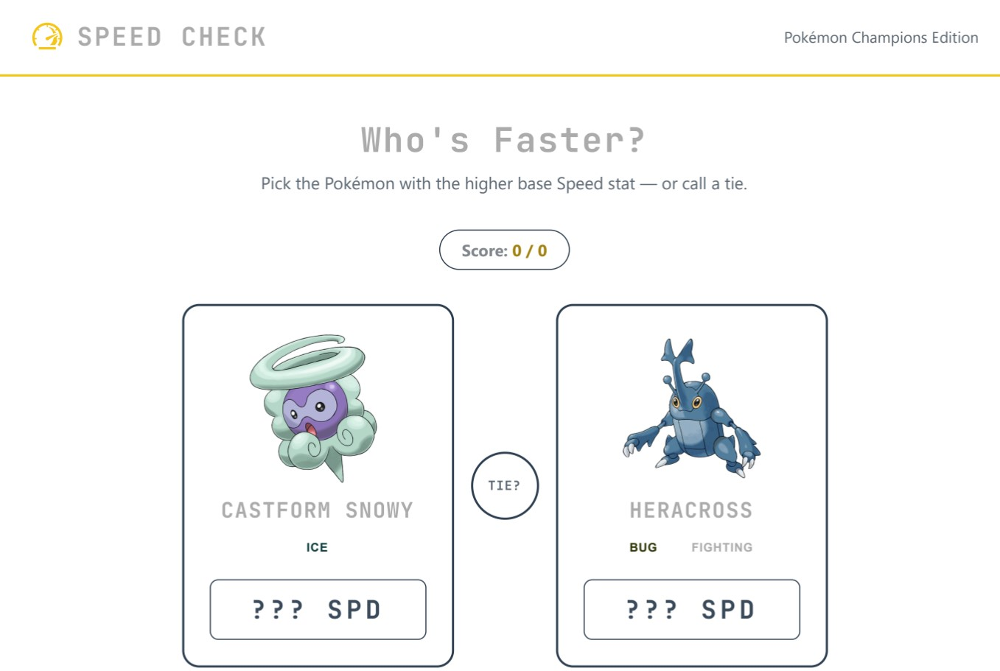

# Pokémon Speed Quiz

A quick-fire browser quiz: two random Pokémon show up, and you guess which
one has the higher base Speed stat — or call it a tie. Every Pokémon (and
form/variant) comes from the roster available in *Pokémon Champions*, and
all stats are pulled live from [PokéAPI](https://pokeapi.co).



## Table of Contents

- [How It Works](#how-it-works)
- [Live Demo](#live-demo)
- [Technologies Used](#technologies-used)
- [Getting Started](#getting-started)
- [Project Structure](#project-structure)
- [Deployment](#deployment)
- [Credits](#credits)

## How It Works

1. Two Pokémon (or form variants — Mega Evolutions, regional forms, etc.)
   are picked at random from a curated list of everything available in
   *Pokémon Champions*.
2. Their data — sprite, types, and base Speed — is fetched live from PokéAPI.
3. Guess which one is faster, or hit **Tie?** if you think their Speed stats
   match.
4. The answer is revealed with color-coded feedback, and your session score
   updates.
5. Click **Next Pokémon** to keep going.

Score is tracked for the current session only — nothing is saved between
page reloads.

## Live Demo

🔗 [Add your deployed Netlify URL here]

## Technologies Used

- **React** + **TypeScript** (via **Vite**)
- **react-router-dom** for routing
- **react-icons** for the nav icon
- **[PokéAPI](https://pokeapi.co)** — no API key or authentication required
- Plain CSS (no framework) — see `src/index.css`
- Deployed on **Netlify** (see `netlify.toml`)

## Getting Started

Clone the repo and install dependencies:

```bash
git clone https://github.com/leestephen0320/pokemon-speed-quiz.git
cd pokemon-speed-quiz
npm install
```

Run the dev server:

```bash
npm run dev
```

Then open the local URL Vite prints in your terminal (usually
`http://localhost:5173`).

No `.env` file or API key is needed — PokéAPI is public and requires no
authentication.

## Project Structure

```
pokemon-speed-quiz/
├── src/
│   ├── api/
│   │   └── API.tsx              # PokéAPI fetch logic
│   ├── components/
│   │   ├── Nav.tsx
│   │   └── PokemonCard.tsx
│   ├── data/
│   │   └── championsList.ts     # curated list of PokéAPI slugs
│   ├── interfaces/
│   │   └── Pokemon.interface.tsx
│   ├── pages/
│   │   ├── Quiz.tsx
│   │   └── ErrorPage.tsx
│   ├── App.tsx
│   ├── main.tsx
│   └── index.css
├── netlify.toml
└── package.json
```

## Deployment

This project deploys as a static site — no server required.

**Netlify:**

1. Push this repo to GitHub.
2. In Netlify: **Add new site → Import an existing project** → connect the
   repo.
3. Netlify reads `netlify.toml` automatically:
   - Build command: `npm run build`
   - Publish directory: `dist`
4. Click **Deploy site**.

The included `netlify.toml` also adds a redirect rule so client-side routes
work correctly on refresh/direct visit.

## Credits

- Pokémon data and sprites via [PokéAPI](https://pokeapi.co)
- Pokémon and Pokémon Champions are trademarks of Nintendo/Game Freak/The
  Pokémon Company. This is an unofficial, non-commercial fan project.